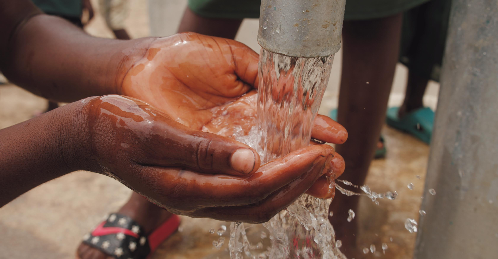
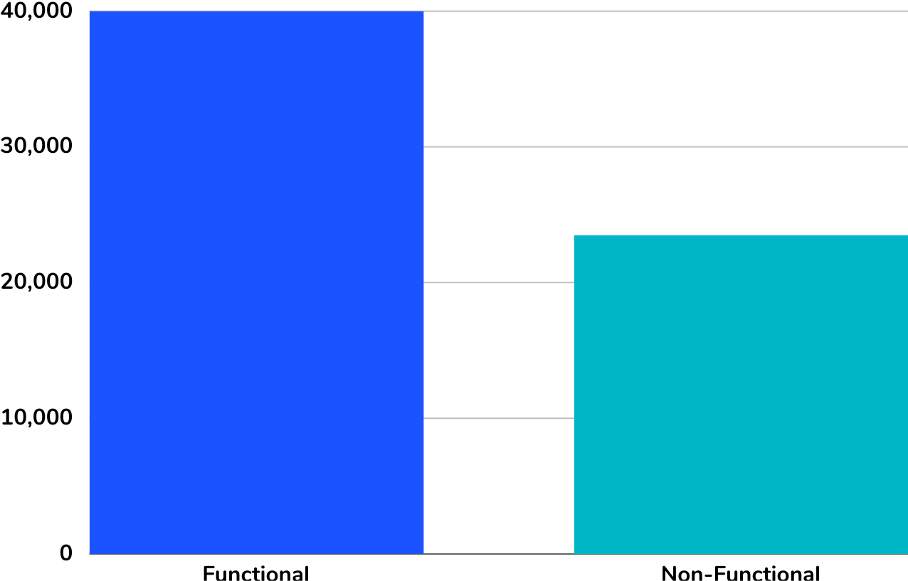
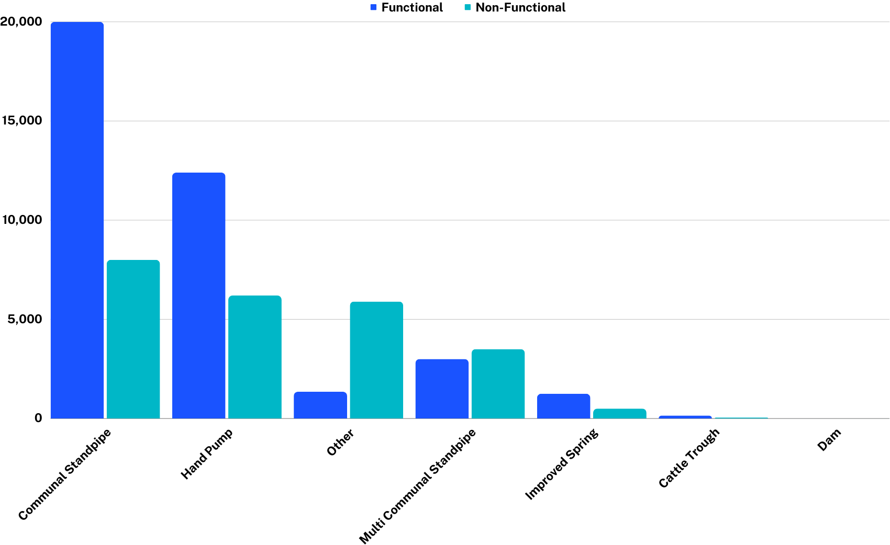
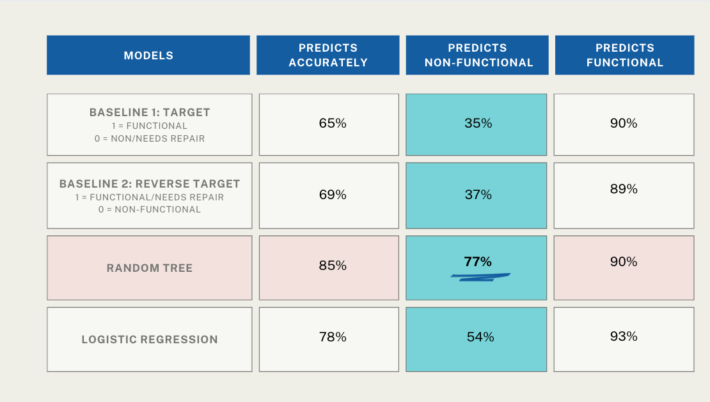
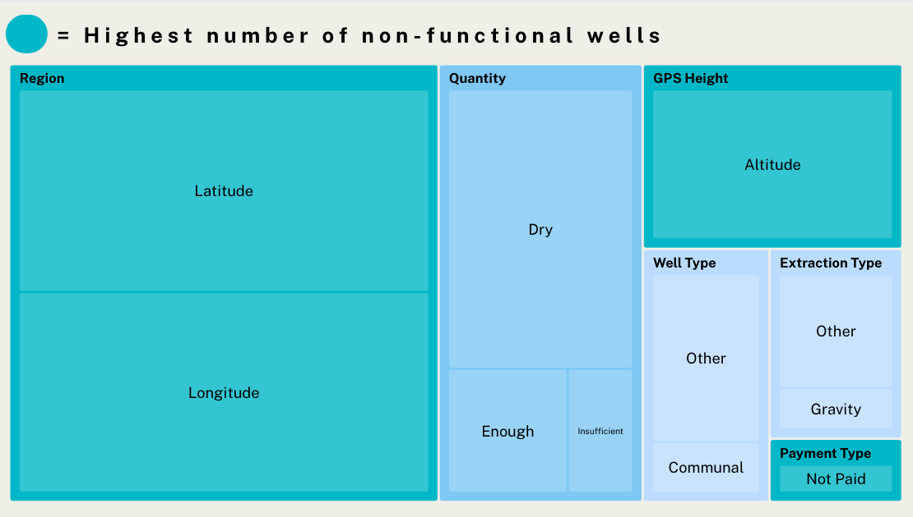

# Tanzania WaterWells Status Prediction

**Authors and Contact Information:** 
- [Goknur Kaya](https://github.com/GoknurK) (Github Lead)
- [Kari Primiano](https://github.com/kkprim) (Technical Lead)
- [Mytreyi Abburu](https://github.com/myt-hue)(Presentation Lead)

17 November, 2023

## Overview

Tanzania, as a developing country, struggles with providing clean water to its population of over 57,000,000. There are many wells (water points) already established in the country, but some are in need of repair while others have failed altogether. The Government of Tanzania is looking to find patterns in non-functional wells to influence how new wells are built. We have analyzed data on almost 60,000 wells across the country of Tanzania.

## Business Problem

Tanzania faces challenges in ensuring access to clean water for its population due to non-functional water wells. We will be looking to predict patterns in non-functional wells to inform more robust construction methods for new wells. Our stakeholders for this project is the Government of Tanzania as we are aiming to minimize the Type II error/false negative; in this case minimizing identifying wells as nonfunctional while they are actually functional.  Focusing on recall (false negative) may be more important to ensure that most of the non-functional wells are correctly identified.

## Data Understanding

The comes from Driven Data - Tanzanian Water Wells
- [Labels](https://www.drivendata.org/competitions/7/pump-it-up-data-mining-the-water-table/data/)
- [Values](https://www.drivendata.org/competitions/7/pump-it-up-data-mining-the-water-table/data/)

**Target**

- functional : the well is operational and there are no repairs needed
- functional needs repair : the well is operational, but needs repairs
- non functional : the well is not operational

**Features**

- amount_tsh : Total static head (amount water available to well)
- date_recorded : The date the row was entered
- funder : Who funded the well
- gps_height : Altitude of the well
- installer : Organization that installed the well
- longitude : GPS coordinate
- latitude : GPS coordinate
- wpt_name : Name of the well if there is one
- num_private :Private use or not
- basin : Geographic water basin
- subvillage : Geographic location
- region : Geographic location
- region_code : Geographic location (coded)
- district_code : Geographic location (coded)
- lga : Geographic location
- ward : Geographic location
- population : Population around the well
- public_meeting : True/False
- recorded_by : Group entering this row of data
- scheme_management : Who operates the well
- scheme_name : Who operates the well
- permit : If the well is permitted
- construction_year : Year the well was constructed
- extraction_type : The kind of extraction the well uses
- extraction_type_group : The kind of extraction the well uses
- extraction_type_class : The kind of extraction the well uses
- management : How the well is managed
- management_group : How the well is managed
- payment : What the water costs
- payment_type : What the water costs
- water_quality : The quality of the water
- quality_group : The quality of the water
- quantity : The quantity of water
- quantity_group : The quantity of water
- source : The source of the water
- source_type : The source of the water
- source_class : The source of the water
- waterpoint_type : The kind of well
- waterpoint_type_group : The kind of well

## Methods

This analysis uses Exploratory Data Analysis, visualization and machine learning methods to decribe trends for waterwells.

Our dataset was ternary classification. We added binary target column

- 0= non-functional  
- 1= functional

About 60% of wells are functional and 40% of the wells are non-functional.



Communal Standpipe and Hand Pump were the two most prevalent waterpoint types in the entire country. Yet, besides other, they had the highest rate of non functionality. It is still unclear from our analysis why the pumps considered 'other' had such a high rate of failure and was something we would have liked to explore more if time permitted.




## Modeling

- Recall is our main metric of model selection

- Our model predicts non-functionalities, while minimizing False negatives.

We have used the following Machine Learning methods:




### Baseline Model - Logistic Regression 

**Precision:**

- Class 0: 0.68 
- Class 1: 0.69

**Recall:**

- Class 0: 0.37 
- Class 1: 0.89 

**F1-Score:**

- Class 0: 0.48 
- Class 1: 0.78

**Accuracy:** 69%

**AUC-ROC** 0.65 which is not that high.

### Random Forest Classifier
This model can provide insights into the importance of various features in predicting well functionality. It's less likely to overfit than individual decision trees and doesn't require feature scaling.

Precision:
- **Precision** is 0.83 for both classes.

Recall:
- **Recall:** is 0.77 for class 0 and 0.90 for class 1.

F1-Score:
- **F1 Score:**  are 0.80 (class 0) and 0.88 (class 1).

Accuracy:
- **Accuracy:** Overall accuracy is 0.85.

Macro and Weighted Averages:
- **Macro and Weighted averages:** Both macro and weighted averages are around 0.85.


AUC-ROC Score:
- **AUC-ROC:** The area under the curve is 0.91, which is high. This means the model can effectively distinguish between the positive class (class 1) and the negative class (class 0).

We also found the top 7 most important features that has the highest impact on our target as following;

 

Based on this, we conducted our last model using important features,


### Logistic Regression Model: Most Important Features

### Interpretation

**Precision:**
- For class 0: 83% precision means that out of all instances predicted as class 0, 83% were actually class 0.

- For class 1: 76% precision indicates that out of all instances predicted as class 1, 76% were actually class 1.

**Recall:**
- For class 0: The recall of 54% is moderate, meaning the model correctly identifies 54% of the actual class 0 instances.

- For class 1: A high recall of 93% indicates the model is very effective at identifying class 1 instances.

**F1-Score:**
- For class 0: The F1-score of 0.65 suggests a balance between precision and recall for class 0, but more weighted towards precision.

- For class 1: The F1-score of 0.84 indicates a strong balance between precision and recall for class 1, favoring recall.

**Accuracy:**
- The overall accuracy of 78% indicates that the model correctly predicts the class for 78% of all instances.

**Macro and Weighted Averages:**
- Macro average treats both classes equally, showing an average precision of 79%, recall of 73%, and F1-score of 74%.

- Weighted average considers class imbalance, showing slightly higher precision and recall, indicating better performance on the more prevalent class 1.

**ROC Score:**
- An ROC score of 0.82 suggests a good ability of the model to distinguish between the two classes. It indicates a favorable balance between the true positive rate and false positive rate across different thresholds.

**Insights:**
- The model performs well overall, especially in predicting class 1, which is indicated by the high recall and F1-score for class 1.

- Model is less effective in correctly identifying class 0 instances, as evidenced by the lower recall for class 0.

- The relatively high number of false positives for class 0 (3162) indicates that the model often misclassifies class 1 instances as class 0.
## Key Findings
- **Geographic Indicators:** Including region and altitude, geographic features are 21% MORE influential in identifying non-functional wells than other features. 

- **Region:** Mbeya, Morogoro, and Kilimanjaro have the highest rates of non-functional wells. Altitude may play an important role in water source access. 

- **Type of Wells:** Communal Standpipe wells are most likely to be a functional well. Other well types have the highest percentage of non-functional wells at 81.38%. Multi Communal Handpipe wells have the second highest percentage of non-functional wells at 53.85%.

- **Payment Type:** Whether a well is paid seems to be a crucial factor. Wells that are not paid have a high number of non-functional wells.

- **Random Forest Classifier:** Our best performing model gave us actionable insights into feature importance and effectively minimized false-negatives.


## Next Steps
- **Investigate Additional Features:** Concentrating on geographical indicators like climate, population, and amount of water available in the area.

- **Time-Series Analysis:** Further consideration of the well ages should be analyzed to predict the average lifetime of more robust well structures.

- **Repairs:** Local governments should look at what type of water wells are needing repairs, and the severity of those repairs, to fine-tune non-functional indicators.


## Sources
- [The World Bank](https://www.worldbank.org/en/news/feature/2022/06/14/the-road-to-better-services-is-paved-with-strong-delivery-institutions-a-rural-water-story)

- [Groundwater Wells](https://www.usgs.gov/special-topics/water-science-school/science/groundwater-wells)

- [Detection of Non-Function Bore Wells Using Maching Learning Algorithms](https://www.researchgate.net/publication/349446319_Detection_of_Non-functional_Bore_wells_Using_Machine_Learning_Algorithms)

## For More Information

Please visit our full analysis in our [Jupyter Notebook](well_detection_ML_algorithms.ipynb) and [Slide Presentation](well_detection_presentation.pdf), 

## Repository Structure

You are currently in the README.md file. The 'well_detection_ML_algorithms.ipynb' file contains the jupyter notebook that provides step-by-step guide to how we came to our conclusion. 'images' file contains the images used in this file. The images were taken from the internet.

```
├── data                                     <- Data file used in this project
├── images                                   <- Images and Graphs used in this project obtained from external and internal source
├── .gitignore                               <- Contains list of files to be ignored from GitHub
├── well_detection_presentation.pdf          <- Slide Presentation of the project
├── README.md                                <- Contains README file to be reviewed    
└── well_detection_ML_algorithms.ipynb       <- Jupyter notebook of the project containing codes and analysis
```